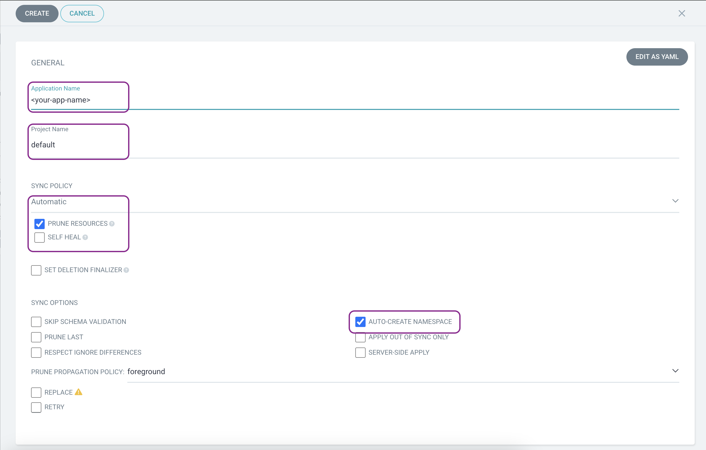

# EKS ArgoCD & CodePipeline

this project contains all the necessary code and to deploy a simple application onto AWS EKS service via ArgoCD and helm.
after finishing the setup argoCD will manage the cluster and update pods when detecting changes in the helm charts.

# Features

- [Prerequisites](#Prerequisites)
- [Cluster Creation-manual](#steps-to-create-a-cluster)
- [Cluster Creation-terraform](#steps-to-create-a-cluster-with-terraform)
- [ArgoCD](#steps-to-deploy-argoCD-via-helm)
- [Install LoadBalancer controller](#install-the-loadbalancer-controller)
- [Ingress to ArgoCD server](#create-an-ingress-service-which-will-create-an-ALB-to-route-traffic-to-the-server)
- [Deploy-App](#Deploy-the-application)

# Prerequisites

### edit the [Ingress-service.yaml](./ArgoCD/Ingress-service.yaml) host to receive traffic from your domain

```sh
   spec:
       rules:
       - host: argocd.whats-the-weather.com  # Set your desired hostname here
```

### edit the [External-DNS.yaml](./ArgoCD/External-DNS.yaml) **--domain-filter** to your domain to filter only the domain you want to add records to (can be multiple separated by commas).

```sh
    args:
        - --source=service
        - --source=ingress
        - --domain-filter=whats-the-weather.com
        - --provider=aws
        - --aws-zone-type=public
        - --registry=txt
        - --txt-owner-id=externaldns
        - --txt-suffix=externaldns
```

### edit the [ArgoCD-Init.sh](./ArgoCD/ArgoCD-Init.sh) and [ArgoCD-destroy.sh](./ArgoCD/ArgoCD-destroy.sh) values to fit your account:

**note**
the cluster name can be found and changed [here](./Terraform/Terraform-modules/modules/eks/eks.tf):
```
    variable "cluster_name" {
    default = "Lab4-EKS-tf" # the cluster name
    type = string
    description = "Cluster for Lab4-Project"
    nullable = false
    }
```

```sh
    region="<your region>"
    cluster_name="<your cluster name>"
    account_ID="<your account ID>"
```


**note** this readme assumes you're at the root folder of this git repository for relative paths.

execute:

```sh
    git clone https://github.com/bensh199/Lab4-ArgoCD.git
```
```sh
    cd ./Lab4-ArgoCD
```

# steps to create a cluster manually

1.  create a vpc using cloud formation

2.  create an eks cluster on 2 private subnets in different AZ's

3.  create an access entry for your user so you'll be able to access your cluster

4.  create a node-group with instance type t3.small to allow enough ip's for your pods
    make sure to select the right Node IAM Role for the group, if you dont have one [create IAM role for Node Group](https://docs.aws.amazon.com/eks/latest/userguide/create-node-role.html#create-worker-node-role)

5.  assuming aws is configured with the right user,

    replace region-code with your region and my-cluster with your cluster's name

```sh
    aws eks update-kubeconfig --region "region-code" --name "my-cluster"
```

6.  execute
    ```sh
    kubectl get svc
    ```
    output should be:
    ```sh
    NAME             TYPE        CLUSTER-IP   EXTERNAL-IP   PORT(S)   AGE
    svc/kubernetes   ClusterIP   10.100.0.1   <none>        443/TCP   1m
    ```

# steps to create a cluster with terraform

**required** you have to have terraform installed locally! if not [install terraform](https://developer.hashicorp.com/terraform/tutorials/aws-get-started/install-cli)

1.  execute the following commands:

```sh
    cd ./infrastructure/Terraform/Terraform-modules/Deployment
```

```sh
    terraform init
```

```sh
    terraform plan
```

```sh
    terraform apply
```

```sh
    cd -
```

2.  (optional) enable ESK API manually and create an access entry for your user so you'll be able to access your cluster via the AWS Console

3.  execute:
    ```sh
    aws eks update-kubeconfig --region "region-code" --name "my-cluster"
    ```

4.  execute 'kubectl get svc', output should be:
    ```sh
    NAME             TYPE        CLUSTER-IP   EXTERNAL-IP   PORT(S)   AGE
    svc/kubernetes   ClusterIP   10.100.0.1   <none>        443/TCP   1m
    ```

# steps to deploy argoCD via helm

* If you've deployed the app via terraform, ArgoCD will be deployed automatically onto the cluster via a script that run's at the end of the infrastructure creation.
and the app should be accessible by the domain you've 

**Optional**

1.  make sure you have helm installed locally, if not [install helm](https://helm.sh/docs/intro/install/)

2.  add the argoCD community managed repo:
    ```sh
    helm repo add argo https://argoproj.github.io/argo-helm
    ```
3.  create a namespace for argoCD in the cluster:
    ```sh
    kubectl create namespace argocd
    ```
4.  deploy argoCD into the cluster using helm:
    ```sh
    helm install my-argo-cd argo/argo-cd --version 6.7.3 --namespace argocd --values ./infrastructure/argocd/values.yaml
    ```
5.  you can check the status of the pods using:

    ```sh
    kubectl get pods -n argocd
    ```

6.  to get the default password execute:

    ```sh
    kubectl get secrets argocd-initial-admin-secret -o yaml -n argocd -o jsonpath="{.data.password}" | base64 -d
    ```

    (in case you get % at the end, its not part of the password)

# steps to create an ingress to access argoCD UI

## install an AWS LoadBalancer Controller which will create an ALB when you create an Ingress service in the cluster

### Create an IAM OIDC provider for your cluster (Needed only if deployed manually, Terraform does this by itself.)

1.  Determine the OIDC issuer ID for your cluster.

    ```sh
    cluster_name=my-cluster
    ```

    ```sh
    oidc_id=$(aws eks describe-cluster --name $cluster_name --query "cluster.identity.oidc.issuer" --output text | cut -d '/' -f 5)
    ```

    ```sh
    echo $oidc_id
    ```

2.  Determine whether an IAM OIDC provider with your cluster's issuer ID is already in your account.

    ```sh
    aws iam list-open-id-connect-providers | grep $oidc_id | cut -d "/" -f4
    ```

    If output is returned, then you already have an IAM OIDC provider for your cluster and you can skip the next step. If no output is returned, then you must create an IAM OIDC provider for your cluster.

3.  Create an IAM OIDC identity provider for your cluster with the following command.
    ```sh
    eksctl utils associate-iam-oidc-provider --cluster $cluster_name --approve
    ```

### Create IAM Role using eksctl

1. Download an IAM policy for the AWS Load Balancer Controller that allows it to make calls to AWS APIs on your behalf.

   ```sh
    curl -O https://raw.githubusercontent.com/kubernetes-sigs/aws-load-balancer-controller/v2.7.1/docs/install/iam_policy.json
   ```

2. Create an IAM policy using the policy downloaded in the previous step.

   ```sh
   aws iam create-policy \
   --policy-name AWSLoadBalancerControllerIAMPolicy \
   --policy-document file://iam_policy.json
   ```

3. Create IAM Role using eksctl
   Replace "my-cluster" with the name of your cluster, 111122223333 with your account ID, and then run the command.
   ```sh
   eksctl create iamserviceaccount \
   --cluster="my-cluster" \
   --namespace=kube-system \
   --name=aws-load-balancer-controller \
   --role-name AmazonEKSLoadBalancerControllerRole \
   --attach-policy-arn=arn:aws:iam::"111122223333":policy/AWSLoadBalancerControllerIAMPolicy \
   --approve
   ```

### install the LoadBalancer Controller

1. Add the eks-charts Helm chart repository.

   ```sh
    helm repo add eks https://aws.github.io/eks-charts
   ```

2. Update your local repo to make sure that you have the most recent charts.

   ```sh
    helm repo update eks
   ```

3. Install the AWS Load Balancer Controller.

   Replace "my-cluster" with the name of your cluster. In the following command, aws-load-balancer-controller is the Kubernetes service account that you created in a previous step.

   ```sh
   helm install aws-load-balancer-controller eks/aws-load-balancer-controller \
   -n kube-system \
   --set clusterName="my-cluster" \
   --set serviceAccount.create=false \
   --set serviceAccount.name=aws-load-balancer-controller
   ```

4. Verify that the controller is installed

   ```sh
   kubectl get deployment -n kube-system aws-load-balancer-controller
   ```

   ```sh
   NAME                           READY   UP-TO-DATE   AVAILABLE   AGE
   aws-load-balancer-controller   2/2     2            2           84s
   ```

# create an ingress service which will create an ALB to route traffic to the server

1. deploy the service by:

   **NOTE** edit the Ingress-service.yaml host to receive traffic from your domain

```sh
   spec:
       rules:
       - host: argocd.whats-the-weather.com  # Set your desired hostname here
```

```sh
    kubectl -n argocd apply -f ./infrastructure/argocd/Ingress-service.yaml
```

2. create a route53 record based on the domain you've selected in the last step that'll forward traffic to the ALB created by the ingress

3. access the argoCD UI at your domain

# Deploy the application

**Important** Before deploying the app change the host name at [Ingress-service](./WeatherApp/templates/Ingress-service.yaml):

```sh
    spec:
        rules:
        - host: app.whats-the-weather.com # Set your desired hostname here
```

**note**

you'll need to create credentials for AWS's CodeCommit so you'll be able to connect ArgoCD to your Repository


## 1. go to the settings tab and then into the repositories section

repo.png" alt="settings" width="500"/>


## 2. add the repository containing the helm chart


## 3. create a new app deployment





## 4. sync the files, the final status should look like this.


5. create a route53 record based on the domain you've selected in the last step that'll forward traffic to the ALB created by the deployment

6. access the Application UI at your domain

# Topology

